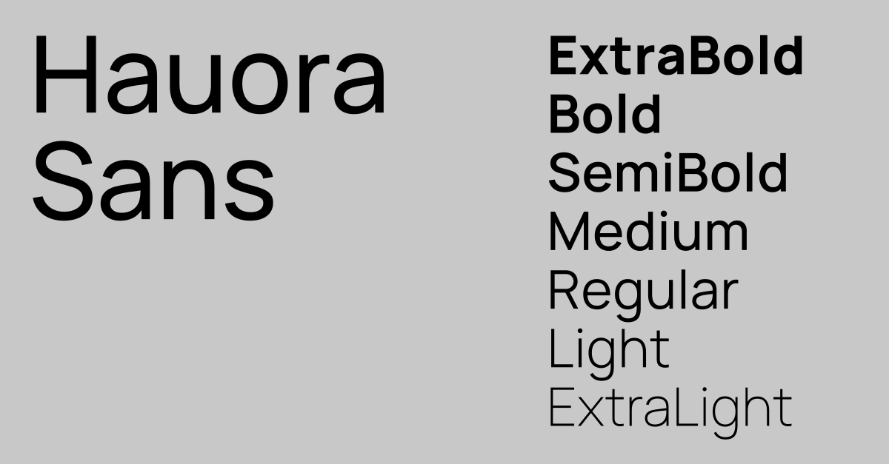

# Hauora Sans

  

Hauora is an open-source sans-serif font family. Hauora is derived from [Manrope](https://manropefont.com/) — designed by [@sharanda](https://github.com/sharanda) — and modified by [WCYS](https://wayneshih.com/) for the [Tiaki Hauora Project](#tiaki-hauora-project). 

### Features
- Semi-condensed, clean, minimal sans-serif font family
- Variable font + 7 legacy weights
- Desktop and web-font formats
- Geometric Digits
- Packed with OpenType features: Case Sensitive, Auto-Apostrophe, Contextual Alternates, Common Ligatures, Custom Icon-Ligatures, Tabular Figures
- Supports most of Latin & Cyrillic languages:
	- Albanian, Belarusian, Bosnian, Bulgarian, Catalan, Croatian, Czech, Danish, English, Estonian, Filipino, Finnish, French, Galician, German, Greek, Hungarian, Icelandic, Indonesian, Irish, Italian, Latvian, Lithuanian, Luxembourgish, Macedonian, Malagasy, Malay, Mongolian, Norwegian, Polish, Portuguese, Romanian, Russian, Scottish Gaelic, Serbian, Slovak, Slovenian, liish, Swahili, Swedish, Taita, Turkish, Welsh, Zulu

### License
This Font Software is licensed under the SIL Open Font License, Version 1.1.

This license is available with an FAQ at http://scripts.sil.org/OFL

— —

### Tiaki Hauora Project

[Tiaki Hauora](https://github.com/TiakiApp) is a BE(Hons) research project of [Preet Patel](https://github.com/PreetPatel) and [Marc Burgess](https://github.com/margeobur). 

